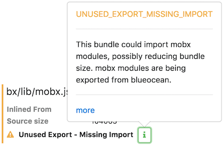
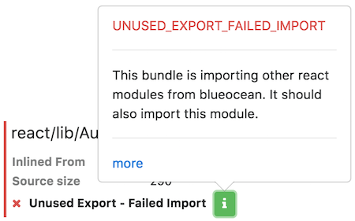

## UNUSED_EXPORT_MISSING_IMPORT

> Unused Export - Missing Import



This warning occurs when a module is found inlined into a bundle and where the package that that module came from is being exported by another bundle. It's a warning because there's a potential optimization not being utilized since the module could be imported, thereby possibly reducing the overall size of the bundle.

To do the import, simply specify the `import('<package-name>')` instruction on the `bundle` generation command in the `gulpfile.js`.

```javascript
const builder = require('@jenkins-cd/js-builder');

builder.bundle('src/js/mycoolapp.js')
    .import('@jenkins-cd/js-extensions@any')
    .import('@jenkins-cd/design-language@any');
```

Note how you can specify a version of `any` when defining the import. This tells `js-modules` that the bundle will accept any version of that package i.e. if another bundle has already loaded that package (package bundle), then that version is acceptable i.e. no need to load another package bundle with the exact version (ala the local dependencies).

## UNUSED_EXPORT_FAILED_IMPORT

> Unused Export - Failed Import



If you're seeing this error then something is not working right with the bundling process. It's likely that you are seeing the bug outlined in [JENKINS-39646](https://issues.jenkins-ci.org/browse/JENKINS-39646).