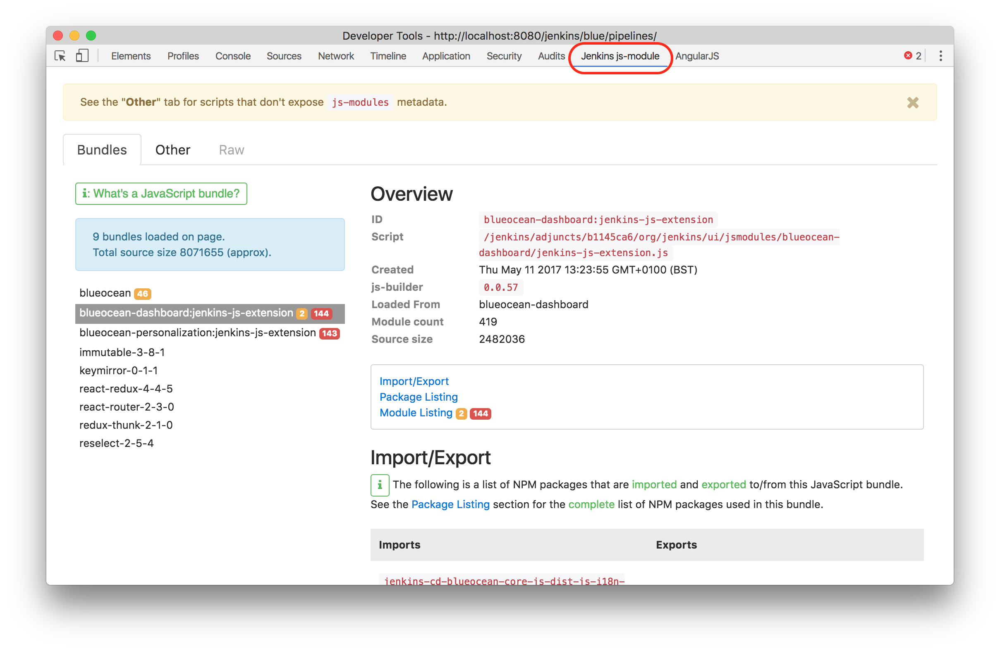
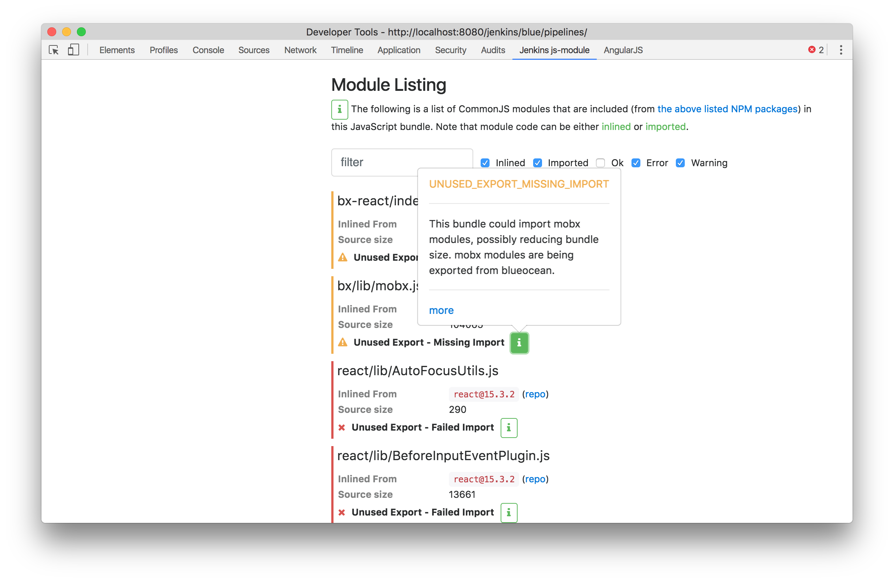

# jenkins-js-modules-chrome-ext

Google Chrome Developer Tools extension for runtime analysis of [@jenkins-cd/js-modules](https://www.npmjs.com/package/@jenkins-cd/js-modules)
compatible JavaScript bundles.

__To install__:

1. [Click here](https://github.com/tfennelly/jenkins-js-modules-chrome-ext/raw/master/chrome-extension.crx) (do __NOT__ double-click) to download the Extension file (`.crx` file).
1. Open your browser's Google Chrome Extensions page (Window -> Extensions menu).
1. Drag the `.crx` file (#1 above) onto your browser's Google Chrome Extensions page (#2 above).

Once installed, simply open the Developer Tools window from the View menu of the browser.

## Adding more "scanners"

One of the key benefits of this plugin is in "scanning" the installed bundles and discovering potential errors or warnings.
Adding more "scanners" would be the main way of contributing to this plugin.

We're currently putting the scanner implementations in [src/problem-scanners](src/problem-scanners). Scanner implementations should
extend the [ProblemScanner](src/ProblemScanner.js) class. See [src/problem-scanners/UnusedExportScanner](src/problem-scanners/UnusedExportScanner.js) as an example.

After creating a scanner implementation, you'll need to update the `scanners` function in [src/bundles.js](src/bundles.js).